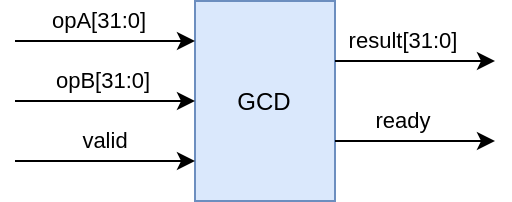
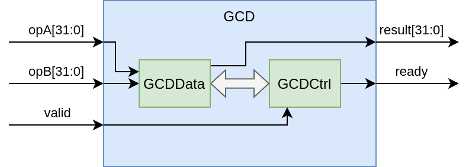
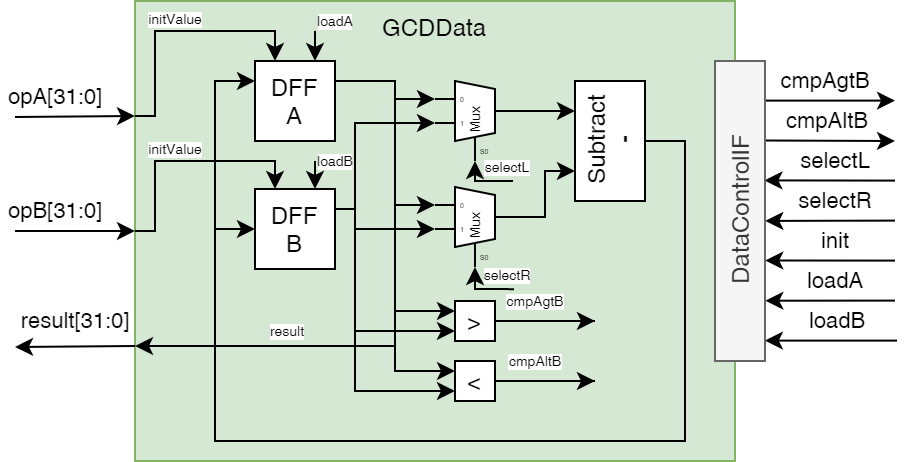
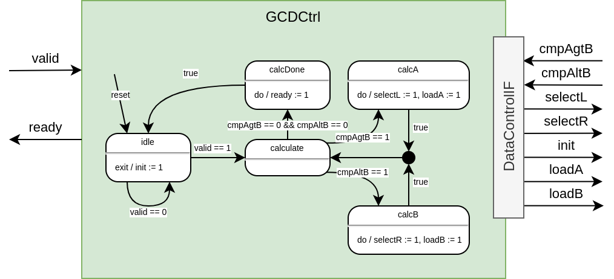
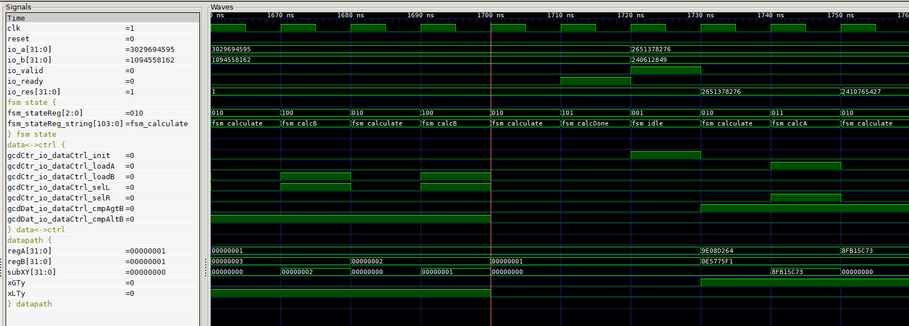

# Tutorial on Implementing a Peripheral for the VexRiscv Based Murax SoC
**By**

**Sallar Ahmadi-Pour - Researcher, University of Bremen, Group of Computer Architecture**

[http://www.informatik.uni-bremen.de/agra/projects/risc-v/](http://www.informatik.uni-bremen.de/agra/projects/risc-v/)

[http://www.informatik.uni-bremen.de/agra/](http://www.informatik.uni-bremen.de/agra/)


## 1. Introduction
Traditional hardware design often requires using languages like VHDL and Verilog and tooling that don't catch errors that can be caught with static analysis of the design. Additionally, information developers receive from the tools is scarce and often lead inexperienced developers on an odyssey. Currently emerging tools (Verilator, Yosys, etc.) for hardware design  and languages for hardware description (SpinalHDL, Amaranth, etc.) tackle these and other existing issues.

Projects like SpinalHDL and the thereon based highly configurable VexRiscv processor experience a rise in popularity and usage amongst academic and commercial users. The increased popularity also requires an increase in educational resources. Due to the specific popularity in the academic environment it only seems natural that researchers document their approaches and insights (not only in peer reviewed publications in a journal). This will allow the next generation of hardware designers to extend and explore big projects like VexRiscv.

## 2. Our Goal for this Tutorial
Murax SoC is a VexRiscv configuration that is a very lightweight RISC-V platform.
It features a basic set of peripherals (UART, GPIO, Prescalers and Timers) around a pipelined memory bus and Apb3 peripheral bus.
The Murax SoC features enough to more than a toy system and being small and thus offering space for extension.

For the choice of possible algorithms, that we want to describe in hardware rather than software, the algorithm for calculating the Greatest Common Divisor (GCD) is a good example to start off. There are many digital design resources available on designing a GCD module.  

We will add the hardware peripheral module to the Murax on the Apb3 bus with memory mapped registers to control the module and transfer the data around for the calculation. 
In this way we transfer the resources the software to the hardware implementation.
The aspects we will shed some light upon will be

a) How do we implement an algorithm that we know from the software domain in a hardware implementation suited for FPGAs?

b) How do we prepare and integrate a new peripheral into the Murax domain and map its control and data ports via memory mapped registers?

c) How do we extend the software to use the peripheral easily in our baremetal code?

For a) we will start off the pseudocode of the GCD and work our way to a hardware implementation in SpinalHDL. 
We will evaluate that design in a SpinalHDL testbench with Verilator as the simulation backend and drive the testbench with randomly generated values which we compare to a software implementation of the same algorithm.
For b) we will look into the features of SpinalHDL and the structure of the Murax SoC to get an idea where and how to integrate our peripheral.
Before adding the peripheral into the Murax we also need to decide on the details of memory mapping our control and data ports to memory mapped registers (i.e, addresses, write/read/clear modes, etc.).

At the end there is a small list of possible extensions from which anyone can continue with their own additions.

## 3. GCD HW Implementation
Let us start the HW implementation by looking at some kind of specification.

```c
// Pseudocode of the Euclids algorithm for calculating the GCD
inputs:  [a, b]
outputs: [ready, a]
ready := False
while(!ready):
  if(a > b):
    a := a - b
  else if(b > a):
    b := b - a
  else:
    ready := True
```
		
The pseudocode shows the GCD algorithm we want to implement in hardware. 
Implementing algorithms in hardware in the Register Transfer Level (RTL) style will require you to separate the control path (so if, else, while, for) and the data path (moving, calculating and comparing data).
Inevitably results from data and comparisons affect the control flow and the control flow affects the data flow. 
Thus the two paths need to communicate the shared information.
But let us start at defining the interface of our module that will calculate the GCD.


	
Our pseudocode already defines some in- and outputs that can aid us in defining the interface for our module. 
At this point we don't want to think about which bus we connect our module to (APB, AXI, Wishbone, etc.). 
We take care about that part later.
We simply know we have our input integers A and B, a signal to indicate the start of the calculation, the result and a signal indicating the completion of the calculation.
We choose 32 bit integers and use a valid-ready mechanism (we add a valid signal to kick of the calculation). 
The interface features the values A, B and result as the data signals, valid and ready are control signals. 
Signals for reset and clock are omitted for readability (unless explicitly used these are handled by SpinalHDL internally anyways).

From this top level perspective we can describe the behavior as follows: Once we apply a set of operands A and B and then apply the valid signal the module calculates the GCD for a variable amount of clock cycles. 
We know the result is ready and can be read once the ready signal is asserted.
Inside the GCD module we will have two other modules: the data path GCDData and the control path GCDCtrl.
We notice again, the data signals (opA, opB and result) belong to our data path and the control signals (valid and ready) belong to our control path.



The data path will consist of some basic RTL blocks like multiplexers, a subtraction, comparators and registers.
The elements are connected and arranged such that they represent the dataflow of the algorithm.
Parts of the data path are enabled by the control path.
The control path will be represented by a Finite State Machine (FSM), which orchestrates the data paths calculation of the result.



The diagram of the data path shows the processing elements for our algorithm in hardware, with their control input and outputs respectively.
From this we can already see what the interface towards the control path looks like. 
The control path needs to know the results of the comparisons. 
Vice versa the data path gets controlled through selecting the subtract operands (or more precisely their order), the register enables and an initiation signal for a defined start state.
In the data path, the D-Flipflops (DFF) hold the values A and B that are used for the calculation and they change value throughout the computation.
A subtraction which is set up for a computation such that `r = x - y` with x being the "left" and y being the "right" operand. 
The left and right operands are multiplexed from our control path inputs. 
Two comparators compute the greater than (cmpAgtB) and less than (cmpAltB) operation. 
The result, the GCD of A and B, will be available in the A register after the calculation is done.
Completion of the calculation is signaled by the control path.



In the diagram of the control path we see the same interface (with inverse directions — this information will be helpful later in SpinalHDL).
The interface of the control path are the top level valid signal, the ready signal indicating the finished computation, the results of the two comparisons `A > B` (*cmpAgtB*) and `B > A` (*cmpAltB*).
Initially the FSM is in an idle state, waiting for the valid signal to be asserted, on exit of this state, the init signal is set to 1 to clock in the values of A and B into their respective registers.
Similar to the pseudocode the FSM loops for the calculation and based on the comparators of the data path and orchestrates the data path to calculate either `a := a - b` or `b := b - a`.
If both if the comparators outputs are 0, the end of the calculation is reached.
Within the `calcDone` state the `ready` signal is set to 1.
With the entry of the `idle` state the module becomes ready to calculate another GCD.
The control path drives all the outputs based on the state in the state machine (Moore FSM). 
The guards on the transitions show the condition with which the respective transition occurs.
These block diagrams, digital logic and the FSM can be quickly implemented in SpinalHDL, things like the `DataControlIF` that interconnect between the data path and control path can be quickly created and connected in SpinalHDL as well.

## 4. SpinalHDL implementation
First we can take a look at the interface between the data and control path. 

```scala
// in GCDTop.scala
case class GCDDataControl() extends Bundle with IMasterSlave{
  val cmpAgtB = Bool
  val cmpAltB = Bool
  val loadA = Bool
  val loadB = Bool
  val init = Bool
  val selL = Bool
  val selR = Bool
  
  override def asMaster(): Unit = {
    out(loadA, loadB, selL, selR, init)
    in(cmpAgtB, cmpAltB)
  }
}
```

We can define a Bundle that implements the `IMasterSlave` Interface (see the [Bundle documentation](https://spinalhdl.github.io/SpinalDoc-RTD/master/SpinalHDL/Data%20types/bundle.html?highlight=master%20slave#master-slave)), which allows us to use a operator (`<>`) to interconnect modules and their signals without explicitly describing each wire and connection (other than inside the Bundle from above).
In the Bundle we can define the signals with their types.
We override the `asMaster()` Method (line 10 to 13) from the `IMasterSlave` interface. 
In the `asMaster()` Method we define the signal direction from the point of view of the control path. 
Thus `cmpAgtB` and `cmpAltB` are inputs and `loadA`, `loadB`, `selL`, `selR`, `init` are outputs.
SpinalHDL will infer the directions for the data path side when we will use the `<>`-Operator.
With that our top level module will look very tidy:

```scala
// in GCDTop.scala
class GCDTop() extends Component {
  val io = new Bundle {
    val valid = in Bool()
    val ready = out Bool()
    val a = in(UInt(32 bits))
    val b = in(UInt(32 bits))
    val res = out(UInt(32 bits))
  }
  val gcdCtr = new GCDCtrl()
  gcdCtr.io.valid := io.valid
  io.ready := gcdCtr.io.ready
  val gcdDat = new GCDData()
  gcdDat.io.a := io.a
  gcdDat.io.b := io.b
  io.res := gcdDat.io.res 
  gcdCtr.io.dataCtrl <> gcdDat.io.dataCtrl
}
```

Lines 2 to 8 define the input/output Bundle inline, lines 9 and 12 instantiate the control and data path. All other lines are interconnecting the IO signals. Note in line 16 we interconnect the control and data path by using the `<>`-Operator as they use the shared interface description from earlier as a input (called `dataCtrl` in the design). We will see this in the respective modules input/output bundles.

Our data path in SpinalHDL looks like this:

```scala
// in GCDData.scala
class GCDData() extends Component {
  val io = new Bundle {
    val a = in(UInt(32 bits))
    val b = in(UInt(32 bits))
    val res = out(UInt(32 bits))
    val dataCtrl = slave(GCDDataControl())
  }
  //registers
  val regA = Reg(UInt(32 bits)) init(0)
  val regB = Reg(UInt(32 bits)) init(0)
  // compare
  val xGTy = regA > regB
  val xLTy = regA < regB
  // mux
  val chX = io.dataCtrl.selL ? regB | regA
  val chY = io.dataCtrl.selR ? regB | regA
  // subtract
  val subXY = chX - chY
  // load logic
  when(io.dataCtrl.init){
    regA := io.a
    regB := io.b
  }
  when(io.dataCtrl.loadA){
    regA := subXY
  }
  when(io.dataCtrl.loadB){
    regB := subXY
  }
  io.dataCtrl.cmpAgtB := xGTy
  io.dataCtrl.cmpAltB := xLTy
  io.res := regA
}
```

Lines 2 to 7 show the Bundle for the IO signals. Note the signal in line 6 (`dataCtrl`), we use the defined Bundle from earlier and give it the direction `slave()` instead `in()` or `out()`. 
This tells SpinalHDL to infer the directions of the Bundle signals according to the `asMaster()` method (in that case the inverse directions). 
We will see this again in the control path.
The rest of the module (or components, thats how SpinalHDL modules are called) consists of defining signals, registers, and behavior. 
Registers can be defined through a `Reg()` components that takes a type and optionally a reset value (via `init()`).
We can write to the register in our `when()` Blocks which could be interpreted as the enable signals for the registers.
(* Side note: technically we describe a multiplexing onto each register as we have multiple cases of enables and different data sources, but we can abstract from that in SpinalHDL a bit and keep it in the back of our minds*).

Now for the control path of our GCD module:
```scala
// in GCDCtrl.scala
class GCDCtrl() extends Component {
  val io = new Bundle {
    val valid = in Bool()
    val ready = out Bool()
    val dataCtrl = master(GCDDataControl())
  }
  val fsm = new StateMachine{
    io.dataCtrl.loadA := False
    io.dataCtrl.loadB := False
    io.dataCtrl.init := False
    io.dataCtrl.selL := False
    io.dataCtrl.selR := False
    io.ready := False
    val idle : State = new State with EntryPoint{
      whenIsActive{
        when(io.valid){
          io.dataCtrl.init := True
          goto(calculate)
        }
      }
    }
    val calculate : State = new State{
      whenIsActive{
        when(io.dataCtrl.cmpAgtB){
          goto(calcA)
        }.elsewhen(io.dataCtrl.cmpAltB){
          goto(calcB)
        }.elsewhen(!io.dataCtrl.cmpAgtB & !io.dataCtrl.cmpAgtB){
          goto(calcDone)
        }
      }
    }
    val calcA : State = new State{
      whenIsActive{
        io.dataCtrl.selR := True
        io.dataCtrl.loadA := True
        goto(calculate)
      }
    }
    val calcB : State = new State{
      whenIsActive{
        io.dataCtrl.selL := True
        io.dataCtrl.loadB := True
        goto(calculate)
      }
    }
    val calcDone : State = new State{
      whenIsActive{
        io.ready := True
        goto(idle)
      }
    }
  }
}
```

The lines 2 to 6 show the input/output signals again, and this time the `dataCtrl` signal, at line 5, shows the direction as `master()`. 
This will apply the directions that we set in the first code snipped.
SpinalHDL offers a library to build FSMs and since this module is only that, our control path is descriptive. 
We set default values for outputs (lines 8 to 13) and apply the according value in the respective state.

The API for FSMs in SpinalHDL offers much more than we use here. 
In each state we can describe actions for `onEntry`, `onExit`, `whenIsNext` and for `whenIsActive` phases (see the [State Machine documentation](https://spinalhdl.github.io/SpinalDoc-RTD/master/SpinalHDL/Libraries/fsm.html)).
The `onEntry` phase refers to the cycle before entering the state, `onExit` will be executed if the next cycle will be in a different state, and `whenIsNext` will be executed if the state machine will be in that state in the next cycle.
That resembles the capabilities of FSM we have in UML/SysML or in StateCharts. 
There is also the possibility to nest FSMs hierarchically or have delay states for a certain amount of cycles.
Describing these things in classic HDL is a lot of boilerplate that SpinalHDL can generate for us instead.

But with these modules we can already run some first simulations, testing our design for functionality.
And as traditional HDLs go we need a testbench for this.
This applies to SpinalHDL as well.
The default way for [simulation in SpinalHDL](https://spinalhdl.github.io/SpinalDoc-RTD/master/SpinalHDL/Simulation/index.html) is by writing a testbench with SpinalHDL and Scala and then getting it simulated through Verilator.
Verilator compiles our HDL (generated from SpinalHDL) to a C++ simulation model, our testbench interacts with that and thus we can have a fast simulation at hand.
Lets jump straight into the simulation testbench and see how SpinalHDL aids our work here:

```scala
// in GCDTopSim.scala
object GCDTopSim {
  def main(args: Array[String]) { 
    SimConfig.doSim(new GCDTop()){dut =>
      def gcd(a: Long,b: Long): Long = {
        if(b==0) a else gcd(b, a%b)
      }
      def RndNextUInt32(): Long = {
        ThreadLocalRandom.current().nextLong(Math.pow(2, 32).toLong - 1)
      }
      var a = 0L
      var b = 0L
      var model = 0L
      dut.io.a #= 0
      dut.io.b #= 0
      dut.io.valid #= false

      dut.clockDomain.forkStimulus(period = 10)
      dut.clockDomain.waitRisingEdge()

      for(idx <- 0 to 50000){
        a = RndNextUInt32()
        b = RndNextUInt32()
        model = gcd(a,b)
        dut.io.a #= a
        dut.io.b #= b
        dut.io.valid #= true
        dut.clockDomain.waitRisingEdge()
        dut.io.valid #= false
        waitUntil(dut.io.ready.toBoolean)
        assert(
          assertion = (dut.io.res.toBigInt == model),
          message = "test " + idx + " failed. Expected " + model + ", retrieved: " + dut.io.res.toBigInt
        )
        waitUntil(!dut.io.ready.toBoolean)
      }
    }
  }
}
```

In line 3 we basically setup our Design Under Test (DUT), and we could setup some other simulations options like generating the VCD wavetrace.
We want to generate some arbitrary amount of testcases and compare the results against a (different) implementation of the GCD algorithm in software. 
Doing this for enough random cases can give confidence in the design, tho it will not always cover edge cases and other aspects that are covered by a constrained random approach, white box testing or formal methods to verify our design.
Lines 4 to 6 are our (recursive) software implementation. 
Lines 7 to 9 generate a random number in the range of a UInt32 — we have to do this by hand because of the nature of Java, Scala and SpinalHDL and how they interact with each other when it comes to numeric values and types.
Lines 10 to 15  setup our input for the DUT and in line 17 and 18 we set up the clock and trigger the first event for our signals to be applied to the inputs.
Lines 20 to 35 describe the application of 50k random integers to our design, and our software model, and then comparing them after we waited for the hardware cycles to pass.
We use the `assert` to output a message to the terminal in case a testcase doesn't match with the software model.
If we add `.withWave` to the line 3 we can obtain a wavetrace (tho its recommended not to run as many testcases, as the dump will be huge otherwise). 



## 5. GCD Murax Integration
Now that we have a standalone module that we want to integrate into the Murax SoC. 

Since the Murax is using the APB bus for the peripherals, our module needs to map the IO signals into the memory mapped space of the APB bus.

```scala
// in Apb3GCDCtrl.scala
object Apb3GCDCtrl {
  def getApb3Config = Apb3Config(
    addressWidth = 5,
    dataWidth = 32,
    selWidth = 1,
    useSlaveError = false
  )
}

class Apb3GCDCtrl(apb3Config : Apb3Config) extends Component {
  val io = new Bundle {
      val apb = slave(Apb3(Apb3GCDCtrl.getApb3Config))
  }
  val gcdCtrl = new GCDTop()
  val apbCtrl = Apb3SlaveFactory(io.apb)
  apbCtrl.driveAndRead(gcdCtrl.io.a, address=0)
  apbCtrl.driveAndRead(gcdCtrl.io.b, address=4)
  val resSyncBuf = RegNextWhen(gcdCtrl.io.res, gcdCtrl.io.ready)
  apbCtrl.read(resSyncBuf, address=8)
  apbCtrl.onRead(8)(resSyncBuf := 0)
  apbCtrl.onRead(8)(rdySyncBuf := False)
  val rdySyncBuf = RegNextWhen(gcdCtrl.io.ready, gcdCtrl.io.ready)
  apbCtrl.read(rdySyncBuf, address=12)
  gcdCtrl.io.valid := apbCtrl.setOnSet(RegNext(False) init(False), address=16, 0)
}
```

Looking at the other peripherals in the Murax, we get an idea how to implement our own Apb3 Mapping (this is also part of the SpinalHDL Workshop).

The components uses the APB3 Bus as a slave peripheral.
In line 14 we create a instance of our GCD module, in line 15 we create a [APB3 Slave Factory](https://spinalhdl.github.io/SpinalDoc-RTD/master/SpinalHDL/Libraries/bus_slave_factory.html) (for our APB bus connection of the component). 
This factory offers us to add memory mapped registers very easily that create all the logic needed to interconnect with our module properly.
A register which can be read and written to can be seen in line 16 and 17 (`driveAndRead()`).
We pass the signal we want to be buffered through that register and an address. 
Our result is [buffered with a `RegNextWhen`](https://spinalhdl.github.io/SpinalDoc-RTD/master/SpinalHDL/Sequential%20logic/registers.html#instantiation) (which buffers the first argument `gcdCtrl.io.res` based on the enable signal that is the second argument `gcdCtrl.io.ready`).
We need this because our result is visible for the clock cycle that the ready signal is asserted true by the control path.
We do something similar with the ready signal, and keep it buffered for longer than just one clock cycle (since we don't know when the software will check these registers).
The result and ready registers will be read-only (`read()`) on their respective addresses.
If the result is read (even if ready was not checked) we will flush both registers as if we fetched the result and don't need it anymore.
The valid signal shouldn't be asserted longer than one clock cycle, this is achieved in line 24. 
We use a register that sets itself to 0/false whenever its written to. 
So if we write a 1/true into it, after one cycle its set to 0/false again.

| Address | Name  | Description                                  | Mode                             |
|---------|-------|----------------------------------------------|----------------------------------|
|       0 | a     | Operand A of the GCD(a,b)                    | R/W                              |
|       4 | b     | Operand B of the GCD(a,b)                    | R/W                              |
|       8 | res   | Result of GCD(a,b)                           | RO, clears res and ready on read |
|      12 | ready | Ready, 1 if result available, 0 otherwise    | RO                               |
|      16 | valid | Valid, write 1 to start calculating GCD(a,b) | WO, clear after write            |


In this way we implemented this memory mapped register bank with various modes. 
Now all thats left is to attach our module to the APB bus of the Murax SoC and write some bare metal firmware to access it.

We created our modules inside the VexRiscv structure as follows:
```
src/main/scala/
├── spinal
└── vexriscv
    ├── demo
    ├── ip
    ├── periph    <--- we add this directory with subdir
    │   └── gcd
    │       ├── Apb3GCDCtrl.scala
    │       ├── GCDCtrl.scala
    │       ├── GCDData.scala
    │       ├── GCDTop.scala
    │       └── GCDTopSim.scala
    ├── plugin
    └── test

```

To integrate our `Apb3GCDCtrl` peripheral into the Murax we need to modify the Murax SoC (`src/main/scala/vexriscv/demo/Murax.scala`) directly.
Deep in the source there will be a comment designating the start of the APB peripherals (`//******** APB peripherals *********`). 
There we are going to add our peripheral and designate some memory mapped space to it.

This step is straightforward as we can add the peripheral similarly to the existing ones.
After the code for the timer `MuraxApb3Timer` module we add our GCD peripheral:

```scala
val gcd = new Apb3GCDCtrl(
  apb3Config = Apb3Config(
    addressWidth = 20,
    dataWidth = 32
  )
)
apbMapping += gcd.io.apb -> (0x30000, 1 kB)
```

And thats it! 

The Murax SoC now supports our own GCD peripheral.
All thats left now is to use the peripheral in a piece of software.

## 6. Software Driver Integration

We start off the software part with the existing `hello_world` example and copy it into a new directory `gcd_world`.

Since we support a new peripheral in hardware we also need to support it from the software (its supported but we are making it more usable for the developer).
We add a new file in the `gcd_world/src` directory called `gcd.h`.

```c
// in gcd.h
#ifndef GCD_H_
#define GCD_H_

typedef struct
{
  volatile uint32_t A;
  volatile uint32_t B;
  volatile uint32_t RES;
  volatile uint32_t READY;
  volatile uint32_t VALID;
} Gcd_Reg;

#endif /* GCD_H_ */

```

With that we define the available memory mapped registers starting from the base address of the peripheral.

We then edit the `murax.h` header file in the same directory:

```c
#ifndef __MURAX_H__
#define __MURAX_H__

#include "timer.h"
#include "prescaler.h"
#include "interrupt.h"
#include "gpio.h"
#include "uart.h"
#include "gcd.h"

#define GPIO_A    ((Gpio_Reg*)(0xF0000000))
#define TIMER_PRESCALER ((Prescaler_Reg*)0xF0020000)
#define TIMER_INTERRUPT ((InterruptCtrl_Reg*)0xF0020010)
#define TIMER_A ((Timer_Reg*)0xF0020040)
#define TIMER_B ((Timer_Reg*)0xF0020050)
#define UART      ((Uart_Reg*)(0xF0010000))
#define GCD       ((Gcd_Reg*)(0xF0030000))


#endif /* __MURAX_H__ */
```

Our addition is the line `#define GCD ((Gcd_Reg*)(0xF0030000))`.
With that we create a way of accessing the memory mapped registers without directly referring to the peripherals address (`0xF0030000`) or having to calculate offsets for the registers.

Now we can start writing our software!

In our `main.c` we add a function to make the peripheral handling a bit more convenient:

```c
uint32_t gcd(uint32_t a, uint32_t b){
	GCD->A = a;
	GCD->B = b;
	GCD->VALID = 0x00000001;
	uint32_t rdyFlag = 0;
	do{
		rdyFlag = GCD->READY;
	}while(!rdyFlag);
	return GCD->RES;
}
```

This function will take the parameters `a` and `b` and applies them to the respective hardware registers `A` and `B` of our peripheral.
Then the `VALID` signal is set (our Apb3 wrapper takes care of setting it back to 0).
All thats left is waiting for the result, which is done by polling the ready flag until its available and then returning our result value `RES`.

The software contains a little more code for formatting numbers to print them onto the UART device but reading and understanding that is left as an exercise to the reader.

So how do we execute our software on the Murax now?

First we compile the software with the make file. For that call `make` inside `src/main/c/murax/gcd_world`.
You should get some minor warnings and a statistics about the memory usage like

```
Memory region         Used Size  Region Size  %age Used
             RAM:        1752 B         2 KB     85.55%
```

Now we can edit the `Murax.scala` one last time before we execute our simulation. 
For this scroll down in the `Murax.scala` file until `MuraxWithRamInit`.
In order to load the memory with our new software instead of the `hello_world` example we edit this part.

```scala
object MuraxWithRamInit {
  def main(args: Array[String]) {
    SpinalVerilog(
      Murax(
        MuraxConfig.default.copy(
          onChipRamSize = 4 kB,
          onChipRamHexFile = "src/main/c/murax/gcd_world/build/gcd_world.hex"
        )
      )
    )
  }
}
```


Then in the root directory we open `sbt` and call `runMain vexriscv.demo.MuraxWithRamInit` or we call `sbt "runMain vexriscv.demo.MuraxWithRamInit"` directly.

This will call SpinalHDL to generate the modified Murax SoC with our small software example.

The last thing we need to do is call the simulation.
For that navigate to `src/test/cpp/murax` and call `make clean run`.

After some time you should see the following output in the terminal:

```
...
BOOT
hello gcd world
gcd(1,123913):
1
gcd(461952,116298):
18
gcd(461952,1162):
2
gcd(461952,11623):
1
```

Keep in mind that we are simulating a SoC. There is no shutdown for our simulation so we have to stop it by ourselves by pressing `CTRL+C`!
Otherwise the simulation won't stop.


## 7. Conclusion

In a tutorial we described how to convert pseudocode for the GCD calculation into SpinalHDL based hardware. Furthermore the hardware was integrated into the VexRiscv based Murax SoC.
To demonstrate the usage an example C project was set up and the hardware peripheral was used from within the software.

This tutorial covered the translation from RTL into SpinalHDL, writing a small wrapper for the APB3 bus used in the Murax SoC, integrating the peripheral into the Murax SoC with designated memory mapped space and writing software in C for the Murax SoC that uses the hardware peripheral to calculate the GCD and print it out on the UART of the Murax SoC.

Now there are a few open challanges to approach as an exercise here are two that would follow up naturally to our existing code:

* The Murax SoC features interrupts, we could stop polling our ready flag and instead trigger an interrupt from the `Apb3GCDCtrl` instead. 
* Write the same algorithm in C and compare it with the hardware peripheral. Is it faster, is it smaller (interacting with the peripheral in software still costs instruction in terms of memory)