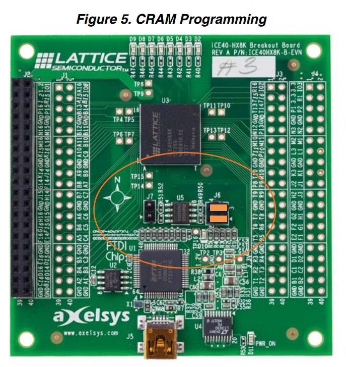

This example is for the
[Lattice iCE40HX-8K Breakout Board](http://www.latticesemi.com/Products/DevelopmentBoardsAndKits/iCE40HX8KBreakoutBoard.aspx).

An image of this board is shown below;


This board can be purchased for ~$USD 49 directly from Lattice and is supported
by the IceStorm
[`iceprog`](https://github.com/cliffordwolf/icestorm/tree/master/iceprog) tool.


# Using the example

## Before Starting

Before starting make sure that your board is configured for `CRAM Programming`
mode. This requires removing jumper `J7` and putting the pair of jumpers on
`J6` to be parallel to the text on the board.

This is shown in **Figure 5** of the
[iCE40HX-8K Breakout Board User Guide](http://www.latticesemi.com/view_document?document_id=50373).
which is also reproduced below;



Once your board is ready, you should follow the setup instructions at the
[top level](../../../README.md).

You should make sure you have the following tools installed;
 * Yosys
 * arachne-pnr
 * icestorm tools (like icepack and iceprog)
 * riscv toolchain
 * sbt

## Building

You should be able to just type `make compile` and get output similar to this;
```
...
  place time 10.14s
route...
  pass 1, 15 shared.
  pass 2, 4 shared.
  pass 3, 1 shared.
  pass 4, 0 shared.

After routing:
span_4     4406 / 29696
span_12    951 / 5632

  route time 9.12s
write_txt bin/toplevel.asc...
icepack bin/toplevel.asc bin/toplevel.bin
```

The process should take around 30 seconds on a reasonable fast computer.

## Programming

After building you should be able to run `make prog`. You may need to run `make
sudo-prog` if root is needed to access your USB devices.

You should get output like the following;
```
iceprog -S bin/toplevel.bin
init..
cdone: high
reset..
cdone: low
programming..
cdone: high
Bye.
```

After programming the LEDs at the top of the board should start flashing in an
interesting pattern.

## Connect

After programming you should be able to connect to the serial port and have the
output echoed back to you.

On Linux you can do this using a command like `screen /dev/ttyUSB1`. Then as
you type you should get back the same characters.
